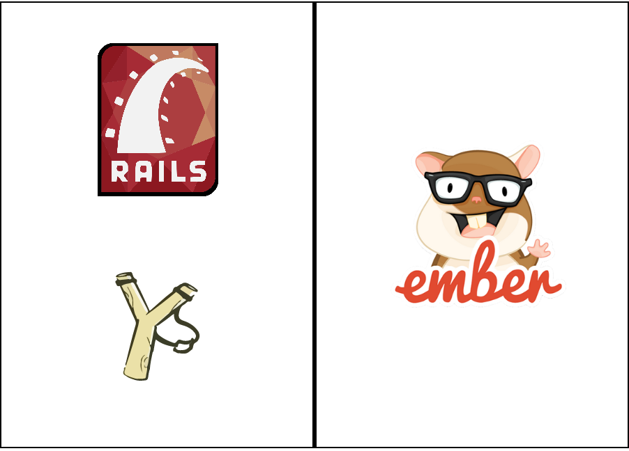

<!-- .slide: class="master01" -->

<!-- section -->
# Cryptopus' path to Ember

Techkafi #Ruby, 30.11.2020
<!-- .slide: class="master04" -->

<!-- slide -->

## Ziel

Die Einbindung, Herausforderungen & Erfahrungen des SPA Frameworks in Cryptopus.

Diskussion und Anregung im Gedanken auf andere Projekte bei Puzzle

<!-- slide -->

## Stack



<!-- section -->

## Roadmap

- 3.0: Ember Modalfenster fuer Formular (Einbindung in bestehende Seiten)
- 3.3: Komplettes UI Overhaul (Unabhaengige Seite)

<!-- slide -->

## TODOs

- JSON API einbauen & erweitern
- Einbindung ins SSR Frontend
- Deployment

<!-- section -->

## JSON API

- DRY-CRUD
- Serializer anpassen

<!-- slide -->

### Serializer: Initializer anpassen

<a href="https://carbon.now.sh/?bg=rgba%28229%2C26%2C18%2C1%29&t=dracula&wt=none&l=ruby&ds=true&dsyoff=20px&dsblur=68px&wc=true&wa=true&pv=56px&ph=56px&ln=true&fl=1&fm=Hack&fs=13.5px&lh=165%25&si=false&es=2x&wm=false&code=%2523%2520Gemfile%250Agem%2520%27active_model_serializers%27%252C%2520%27%7E%253E%25200.10.10%27%250A%250A%2523%2520%2520initializers%252Factive_model_serializers.rb%250AActiveModelSerializers.config.adapter%2520%253D%2520%253Ajson_api%250A%250AActiveSupport.on_load%28%253Aaction_controller%29%2520do%250A%2520%2520require%2520%27active_model_serializers%252Fregister_jsonapi_renderer%27%250A%2520%2520ActiveModelSerializers.config.key_transform%2520%253D%2520%253Aunderscore%250Aend" target="_blank">Click here to see unicorns</a>

<!-- section -->

## Ember ins SSR Frontend

- RootElement
- locationType
- RedirectedRoutesController

https://guides.emberjs.com/release/configuring-ember/embedding-applications/

<!-- slide -->

### locationType

#### 3.0:
hash: Anchor based <br>(**#**/accounts/new => accounts.new)
#### 3.3:
history: Nutzt die HTML 5 History API <br>(/accounts/new => accounts.new)

<!-- slide -->

### 3.3: RedirectedRoutesController

- Matchers fuer Ember Frontend Routes

```
render file: Rails.root.join('public/frontend-index.html')
```

<!-- section -->

## Deployment

- Rake Tasks
- 3.0
- 3.3

<!-- slide -->

### Rake Tasks

- prepare-frontend
- clean-frontend

<!-- slide -->

### 3.0

- JS & CSS in public kopiert
- Per `sed` in application script tag src angepasst (mit fingerprint)

<!-- slide -->

### 3.3

- Komplettes Frontend gebuildet und kopiert
- Ember index.html als frontend-index.html geliefert

<!-- section -->

## Hindernisse

- Ein Root Element fuer die ganze App
- Kein "persistenter" Storage
- Zusaetzliche Rake Tasks fuer/vor E2E Tests
- Zweispurigkeit
- Einarbeit Team

<!-- slide -->

## Fragen/Diskussion
